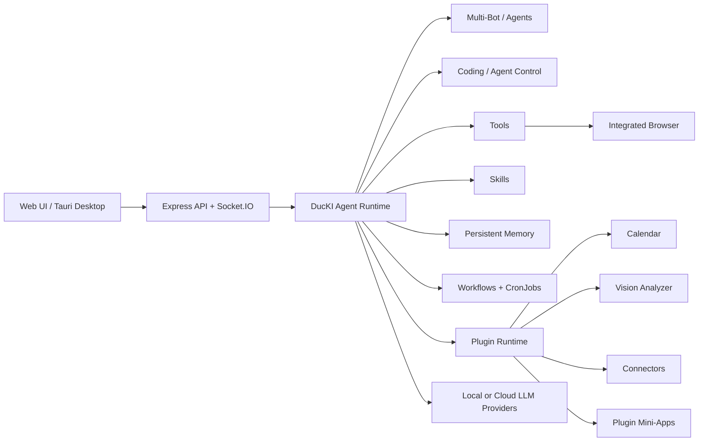
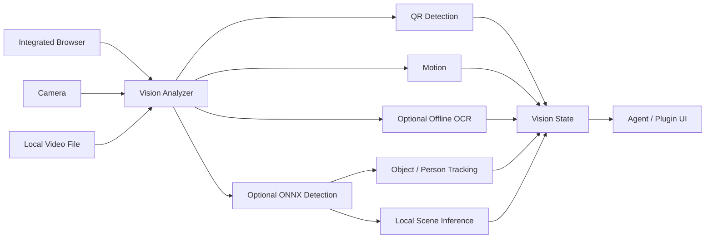

# 🦆 DucKI Agent

**A self-hosted AI agent platform for chat, coding, multi-agent workflows, automation, persistent memory, browser use and local-first vision.**

DucKI combines a Node.js agent runtime, React web UI, extensible skills/tools, bots, workflows and a file-first plugin system in one project. Run it with local models through LM Studio or Ollama, or connect OpenRouter/OpenAI-compatible providers when you want cloud models.

[**🌐 ducki.cloud**](https://ducki.cloud) · [**⚡ Install**](https://ducki.cloud/download) · [**📘 Docs**](https://ducki.cloud/docs) · [**🧩 Plugins**](#-plugin-system) · [**👁 Vision Analyzer**](#-vision-analyzer) · [**❤️ Sponsor**](https://ducki.cloud/sponsor)


> DucKI is under active development. The UI changes quickly, so this README uses architecture diagrams instead of an old static chat screenshot. Current setup guides and UI documentation live at **[ducki.cloud/docs](https://ducki.cloud/docs)**.

## ✨ What DucKI is

DucKI is more than a chat interface. It is a local/self-hosted agent environment where the same runtime can reason, use tools, work with files, control a browser, remember information, delegate to specialized bots, execute coding tasks, run workflows and automations, and load complete mini-apps as plugins.



## 🚀 Highlights

| Area | What it provides |
| --- | --- |
| 🤖 **Multi-agent & Bots** | Create specialized bots with their own role, skills and chat context; use dedicated bot chats alongside the main agent. |
| 💻 **Coding / Agent Control** | Integrated coding workspace for agent-driven implementation and iterative development workflows. |
| 🧠 **Persistent Memory** | Agent/user memory, semantic knowledge, curation/approval flows and LLM-Wiki integration. |
| 🛠️ **Tools** | Filesystem, project/task management, HTTP, shell, git, browser automation, workflow, cronjob, history, MCP and more. |
| 📚 **Skills** | Markdown-based agent skills with automatic selection, explicit activation and per-bot specialization. |
| 🕸️ **Workflow Engine** | Build and run graph-based workflows, including tool/agent execution and resumable flows. |
| ⏰ **Automations** | CronJobs can launch prompts, tasks, workflows and other scheduled actions. |
| 🌐 **Integrated Browser** | Puppeteer-based browser sessions, interaction, screenshots, downloads, PDFs and live frame streaming. |
| 👁 **Vision Analyzer** | Browser, camera and local video analysis with QR, motion, optional OCR, ONNX object detection and tracking. |
| 🧩 **Plugin System** | Drop-in tools, skills, settings, SQLite storage, OAuth/connectors, widgets and full frontend mini-apps. |
| 🔌 **MCP** | Register MCP servers, discover tools and call or stream remote MCP tools. |
| 💬 **Messaging** | Connector/gateway support including Discord and Telegram plugins plus gateway infrastructure. |
| 🖥️ **Desktop** | Tauri frontend and backend-server apps for a desktop/self-hosted setup. |
| 🦆 **Desk Pet** | Configurable animated companion reacting to agent state and UI events. |

## 👁 Vision Analyzer

The bundled **Vision Analyzer** plugin turns DucKI's browser, a local camera or a local video file into a local-first visual source.

**Sources**

- Integrated DucKI browser sessions
- Camera via explicit browser permission
- Local video files selected by the user

**Local capabilities**

- QR-code detection in the frontend
- Motion detection
- Optional offline OCR with Tesseract.js
- Optional ONNX object/person detection
- Bounding boxes and lightweight per-source tracking IDs
- Local scene inference from recognized objects
- Optional configured Vision-LLM analysis when Local-only mode is disabled



The plugin is located at:

```text
apps/server/plugins/vision-analyzer/
```

Its heavier local components are **optional**. Browser/camera/video UI, QR and motion do not require the ONNX/OCR packs. Models are downloaded only when explicitly requested from the plugin UI.

## 🧩 Plugin System

Plugins are first-class DucKI extensions and live in:

```text
apps/server/plugins/<plugin-name>/
```

Each plugin has a `plugin.json` manifest and can contribute one or more of the following:

- declarative data-source tools
- sandboxed script tools
- trusted Node module tools
- agent skills
- plugin-specific settings and encrypted secrets
- isolated SQLite storage
- OAuth/connectors
- sidebar/dashboard widgets
- a complete frontend mini-app
- explicitly declared host capabilities/permissions for trusted plugins

A typical plugin looks like this:

```text
apps/server/plugins/my-plugin/
├── plugin.json
├── tools/
├── skills/
├── frontend/
├── widgets/
└── package.json          # optional runtime dependencies
```

Plugins can call their own tools from a frontend through the plugin invoke API, allowing mini-apps such as Calendar and Vision Analyzer to stay self-contained.

### Bundled plugins

The repository currently includes a growing set of plugins, including:

| Plugin | Purpose / example |
| --- | --- |
| `calendar` | Persistent calendar mini-app with plugin storage and automation hooks |
| `vision-analyzer` | Local-first browser/camera/video vision pipeline |
| `social-media` | Media analysis workflow using agent vision/video capabilities |
| `video-editor` | Video-related plugin workflow/UI |
| `github-connector` | GitHub connector/tool integration |
| `discord-connector` | Discord integration |
| `telegram-connector` | Telegram integration |
| `homeassistant` | Home Assistant integration |
| `notes` | Plugin-owned notes/storage frontend |
| `news` | News-oriented plugin |
| `shopping-list` | Persistent shopping-list mini-app |
| `time-tracking` | Time-tracking plugin |
| `meal-planner` | Meal planning |
| `invoicing` | Invoicing workflow/plugin |
| `bitcoin-puzzle` | Bitcoin-focused plugin/example |

See **`apps/server/plugins/`** for the current list.

## 🤖 Bots & Multi-Agent Work

DucKI supports dedicated bots in addition to the main agent. This makes it possible to keep specialist behavior separated instead of forcing one giant system prompt to handle every task.

Typical specialist roles include:

- Coding Agent
- Research Agent
- Code Review Agent
- UI/UX Agent
- Documentation Agent
- Memory Agent
- Business Agent
- Content Agent

Each bot can work with a focused role and skill set, while bot chats provide separate working contexts in the Web UI.

## 💻 Coding & Agent Control

The `/coding` area is the workspace for agent-assisted development. It is designed for iterative implementation rather than a single prompt/response cycle and lives alongside the normal chat, projects, tasks and agent monitoring pages.

DucKI's tooling can combine:

- project/file context
- filesystem operations
- shell commands
- git operations
- browser checks
- task/workflow context
- skills and persistent memory

Optional tools remain controllable from the Tools settings instead of being exposed blindly to every run.

## 🧠 Memory, Skills & Knowledge

### Persistent Memory

The memory system supports agent/user knowledge and controlled update flows. Memory can be added, replaced, removed and curated rather than being an append-only chat dump.

### Skills

Skills are Markdown-based instruction bundles (`SKILL.md`) and can be enabled, selected automatically or assigned as focused capabilities for specialized agents/bots.

### LLM-Wiki

Files from the shared workspace can be ingested into moderated searchable knowledge. Candidate chunks can be approved or rejected before they become trusted knowledge, and approved content can optionally feed semantic memory.

## 🌐 Browser & Media

The built-in browser tool runs browser automation in an isolated worker process and supports actions such as navigation, click/type, form filling, screenshots, cookies, downloads and PDF capture.

Images and video attachments can also use DucKI's media pipeline:

- images → vision-capable provider
- videos → transcript + sampled frames
- audio/voice → configured speech-to-text pipeline

Trusted plugins can access narrow agent capabilities such as image/video analysis without receiving the raw LLM provider object.

## 🔧 Architecture

```text
apps/
├── server/
│   ├── src/                    Express + Socket.IO backend
│   └── plugins/                Bundled/runtime plugins
├── web/                        React + Vite Web UI
├── cli/                        CLI
├── tauri-desktop/              Desktop frontend wrapper
└── tauri-server/               Desktop/backend tray app

packages/
├── agent/                      Agent loop, skills, memory, plugin runtime
├── tools/                      Built-in tools and browser worker
├── providers/                  LLM provider integrations
├── database/                   SQLite/database services
├── logger/
└── shared/

skills/                         Core/user skill folders
storage/                        Runtime data and logs
```

The system intentionally separates the UI, backend, agent runtime, tools and plugins so features can evolve without turning the main agent loop into one monolithic module.

## ⚡ Quick Start

### One-command install

**Windows (PowerShell)**

```powershell
irm https://ducki.cloud/install.ps1 | iex
```

**macOS / Linux / Raspberry Pi**

```bash
curl -fsSL https://ducki.cloud/install.sh | bash
```

Installation and update instructions are maintained at **[ducki.cloud/download](https://ducki.cloud/download)**.

### Development from source

Requirements from the workspace: **Node.js 20+** and **pnpm 9+** (the repository currently pins pnpm 10.x).

**Linux / macOS / WSL**

```bash
git clone https://github.com/davidduckwitz/ducKI-Agent.git
cd ducKI-Agent
pnpm install
cp .env.example .env
pnpm dev
```

**Windows PowerShell**

```powershell
git clone https://github.com/davidduckwitz/ducKI-Agent.git
cd ducKI-Agent
pnpm install
Copy-Item .env.example .env
pnpm dev
```

Default development endpoints:

- Web UI: `http://localhost:5173`
- Backend API: `http://localhost:3001`
- Health: `http://localhost:3001/health`

Then start with:

1. `/settings` — configure provider and model.
2. `/tools` — enable the optional tools you actually need.
3. `/skills` — configure skills.
4. `/chat` — use the main agent.
5. `/bots` / `/bot-chats` — create and use specialist agents.
6. `/coding` — open Agent Control / coding workspace.
7. `/plugins` — configure plugin apps and integrations.
8. `/workflow` / `/cronjobs` — build repeatable or scheduled work.
9. `/agents` — inspect active agent runs.

## 🧰 Useful Commands

```bash
# Development
pnpm dev

# Build
pnpm build
pnpm build:web
pnpm build:server

# Desktop
pnpm tauri:dev
pnpm tauri:server:dev
pnpm tauri:all:dev
pnpm tauri:build
pnpm tauri:server:build

# Quality / utilities
pnpm typecheck
pnpm test
pnpm lint
pnpm skills:validate
```

## 🖥 Desktop Applications

DucKI includes separate Tauri apps for the frontend and backend server:

- **`tauri-desktop`** — desktop wrapper for the Web UI; can connect to a local or remote backend.
- **`tauri-server`** — tray-based backend wrapper with local server management and port handling.

For local development of both together:

```bash
pnpm tauri:all:dev
```

## 🔌 MCP & Messaging

### MCP

The `/mcp` page manages MCP server registrations and discovered tools. DucKI supports normal tool calls as well as streamed MCP execution.

### Messaging / Connectors

The gateway and plugin infrastructure can connect the agent to external channels. Connector plugins currently include Discord and Telegram, while the core gateway layer supports additional integrations and custom workflows.

## 🔐 Local-first & Security Model

DucKI is designed so that local providers, local storage and local tooling can be used without requiring a cloud LLM.

A few important boundaries:

- sandboxed plugin scripts do not receive unrestricted Node access
- trusted `node` plugins are privileged code and should only be installed from sources you trust
- host capabilities can require explicit manifest permissions (for example browser frames or camera access)
- plugin secrets/settings are separated from normal plugin frontend state
- optional tools can be disabled so they are not available to the agent
- Vision Analyzer defaults to Local-only behavior and requires explicit user actions for camera/model setup

Self-hosting is not the same as automatic security: review plugins, tool permissions, exposed ports and provider configuration before making an instance reachable from outside your trusted network.

## 🗺 Main UI Areas

| Route | Area |
| --- | --- |
| `/dashboard` | Overview |
| `/chat` | Main agent chat |
| `/bots` | Bot management |
| `/bot-chats` | Specialist bot chats |
| `/coding` | Coding / Agent Control |
| `/projects` | Projects |
| `/tasks` | Tasks |
| `/workflow` | Workflow editor |
| `/cronjobs` | Scheduled automation |
| `/mcp` | MCP servers/tools |
| `/tools` | Tool management |
| `/skills` | Skill management |
| `/plugins` | Plugin management |
| `/memory` | Memory + LLM-Wiki |
| `/gateway` | Messaging gateway |
| `/agents` | Live agent activity |
| `/logs` | Logs |
| `/settings` | Runtime configuration |

## 🛠 Troubleshooting

If the development UI or API does not start:

```bash
# Windows: inspect frontend port
netstat -ano | findstr :5173

# Linux/macOS
lsof -i :5173
```

The Vite frontend can move to another available port when `5173` is already occupied. The backend defaults to `3001`.

For agent/plugin/runtime errors, also inspect the DucKI Logs page (`/logs`) and server console output.

## 🤝 Contributing

Contributions, issues and ideas are welcome — especially new plugins, skills, connectors, agent improvements and fixes.

A simple contribution flow:

1. Create a feature branch.
2. Keep changes focused and reversible.
3. Run the checks relevant to your change.
4. Open a PR with a short summary and validation notes.

## ❤️ Sponsors & Support

DucKI is free and open source. Sponsorship helps fund development time, infrastructure and future features.

- **Sponsor:** [ducki.cloud/sponsor](https://ducki.cloud/sponsor)
- **PayPal:** https://www.paypal.me/davidduckwitz
- **Bitcoin:** `1AinLLwLGvh2Y51a53PAYi5PdPBsLwpU1G`

### Sponsors

> No sponsors yet — [be the first](https://ducki.cloud/sponsor).

## 🔗 Links

- **Website:** https://ducki.cloud
- **Installation:** https://ducki.cloud/download
- **Documentation:** https://ducki.cloud/docs
- **Sponsor:** https://ducki.cloud/sponsor
- **Author:** https://www.davidduckwitz.de/

## 📄 License

DucKI is released under the **MIT license**. Individual plugins or downloaded third-party models may declare their own licenses; check the relevant `plugin.json` or model metadata when redistributing them.
